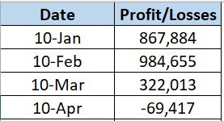
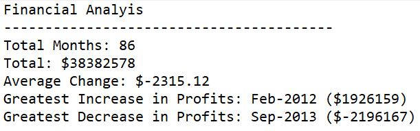
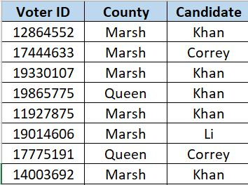

# Python-Challenge
* Using python to perform data analytics on two csv files
* The python scripts perform similar functions, but there are differences between them. One python script performs analysis on bank data and the other is analyzing voting poll data
### Important Note
* In order to run either file without errors you must be in the correct folder in Python. This means you must go to "Open Folder" in Python and open the appropriate folder or else the relative path will not work and the code will crash
  * For main_bank.py you must open the "01 PyBank" folder. 
  * For main_poll.py you must open the "02 PyPoll" folder

# PyBank
### Starting Data
* The bank data used in this repo is budget_data.csv. The dataset is extremely simple there are only two columns, Date and Profit/Losses, and 87 rows. Here is a sample of the dataset

### Pseudo Code
1. Import Dependencies
2. Relative Path to budget_data.csv
3. Initialize variables
4. Open CSV file. Use a for loop to read data from csv into python lists 
5. Find the total number of months in the dataset. By finding the number of unique dates
6. Use a for loop to calculate the total changes over the period 
7. Calculate the average change, max change and min change. Find the dates of the max and min changes 
8. Print results to terminal. Create a Results.txt file that will also have the results 
* The python script used to analyze the bank data is main_bank.py.

### Results 

# PyPoll
### Starting Data
* The voting poll data used in this repo is election_data.csv. The dataset has three columns, Voter ID, County, and Candidate, and more than a million rows. One of the benefits of python is that it works well with large datasets like this one. If I were to try to use VBA macros for this repo it would take significantly longer to execute the code and the code might even crash because it cannot handle files this large.

### Pseudo Code
1. Import Dependencies
2. Relative Path to election_data.csv
3. Initialize variables
4. Open CSV file. Use a for loop to read data from csv into python lists
5. Create a list of Candidates by extracting unique values using set function
6. Calculate total number of votes per candidate and percentage of votes per candidate.
7. Sort lists from most votes to least votes 
8. Print results to terminal. Create a Results.txt file that will also have the results  
* The python script used to analyze the poll data is main_poll.py. 

### Results 

